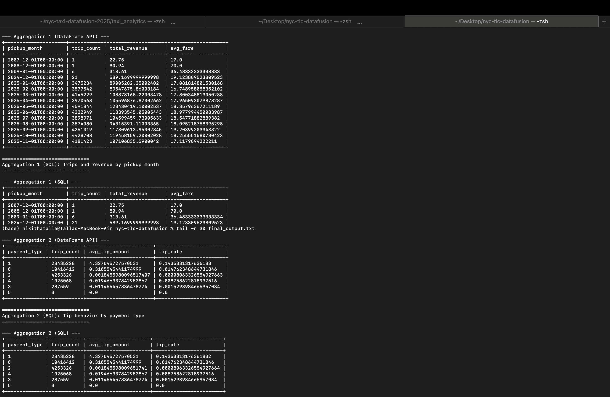

# NYC TLC 2025 DataFusion Aggregations (Rust)

## What this project does
- Loads NYC TLC Yellow Taxi trip records for year 2025 (monthly Parquet files)
- Runs required aggregations using DataFusion DataFrame API and SQL
- Prints results in readable tables to the terminal

## Dataset source
- NYC TLC Trip Record Data: https://www.nyc.gov/site/tlc/about/tlc-trip-record-data.page

## How to download data
1. Download Yellow Taxi monthly Parquet files for 2025 from the NYC TLC page.
2. Place files into: `./data/yellow/2025/`
   Example filenames:
   - `yellow_tripdata_2025-01.parquet`
   - ...
   - `yellow_tripdata_2025-12.parquet`
   Note: If a month is missing (ex: December), the program will warn but still run on available months.

## How to run
```bash
cargo run --release
# or specify custom folder:
cargo run --release -- --data-dir ./data/yellow/2025
## Aggregations

### Aggregation 1: Trips and revenue by month
Groups by pickup month (derived from pickup datetime). 
Calculates total trips, total revenue, and average fare amount for each month, sorted in ascending order.

### Aggregation 2: Tip behavior by payment type
Groups by payment type. 
Calculates total trips, average tip amount, and tip rate (total tip / total amount), sorted by trip count descending.

## Screenshot


